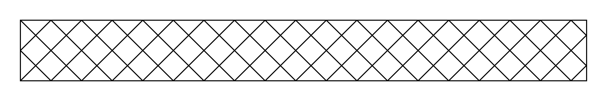

<div align="right"><p style='align: right;'>
Languages: <a href="README-RU.md"></a> <a href="README.md"></a> 
</p></div>

# TyKo — Kotlin bindings for Typst

**_Внимание: Эта библиотека недавно была полностью переработана. Поэтому файлы README и руководство устарели. Я обновлю их, как только получится._**

## Введение

Эта библиотека позволяет:

- Оперировать значениями из Typst:

    ```kt
    val tiling = TTiling(
        sz = TArray(30.pt, 30.pt),
        body = TSequence(
            TPlace(body = TLine(start = TArray(0.pc, 0.pc), end = TArray(100.pc, 100.pc))),
            TPlace(body = TLine(start = TArray(0.pc, 100.pc), end = TArray(100.pc, 0.pc))),
        )
    )
    ```
  (пример из [официальной документации про tiling](https://typst.app/docs/reference/visualize/tiling/))

  Все параметры имеют те же названия, что и в Typst, кроме `size`,
  который назван `sz` для совместимости с `List` из Kotlin.

- Превращать их в код на Typst:

    ```kt
    tiling.repr()
    ```

  (Получаемое предстваление не является человеко-читаемым, хотя некоторые косметические улучшения планируются)

- Доступ к компилятору Typst:

  Компилятор требует двух вещей: [TypstSharedLibrary](https://github.com/LDemetrios/typst-shared-library),
  скомпилированный под вашу систему (см. [Установка](https://github.com/LDemetrios/TyKo#Installation)),
  и `World` (см. [документацию  — пока доступна только на английском](manual.pdf)). Встроенных реализаций `World` пока только две.

    ```kt
    val lib = TypstSharedLibrary.instance(Path("../libtypst_shared.so"))
  
    val compiler = WorldBasedTypstCompiler(lib, DetachedWorld())

    val anotherTiling = compiler.evalDetached(
        """
            tiling(
                size: (30pt, 30pt),
                spacing: (10pt, 10pt),
                relative: "parent",
                square(
                    size: 30pt,
                    fill: gradient.conic(..color.map.rainbow),
                ),
            )
        """.trimIndent()
    )
  
    compiler.close()
    ```

  Компиляторы — Closeable. Если их не закрывать, это может привести к утечкам и нативной, и java- памяти.

- Компиляция в html, png и svg (pdf скоро будет):

    ```kt
    val page = TSequence {
        +TSetPage(height = TAuto, margin = 20.pt)
        +TRect(
            fill = tiling,
            width = 100.pc,
            height = 60.pt,
            stroke = 1.pt,
        )
    }
    val fileCompiler = WorldBasedTypstCompiler(lib, SingleFileWorld("#" + page.repr()))

    val compiled = fileCompiler.compilePng(ppi = 288.0f)[0] // Oth page
    File("output.png").writeBytes(compiled)
    ```

  

## Дальнейшая документация

См. [документацию на английском](manual.pdf)

## Установка

Эта библиотека пока что в стадии бета-тестирования.

- Соберите вспомогательную библиотеку:
```bash
git clone https://github.com/LDemetrios/LDemetriosCommons.git
cd LDemetriosCommons 
gradle publish
cd ..
```

- Соберите shared lib:
```bash
git clone https://github.com/LDemetrios/typst-custom-serialize
cd typst-custom-serialize
cargo build --release
cd ..
```

скопируйте результат сборки (например, `target/release/libtypst_shared.so`), остальное вам не понадобится.

- Соберите эту библиотеку:
```bash
git clone https://github.com/LDemetrios/TyKo
cd TyKo
gradle publish
cd ..
```

(Используйтe подходящий `gradlew`, если gradle у вас не установлен)

Теперь вы можете использовать эту библиотеку:

### Maven

```xml
<dependency>
    <groupId>org.ldemetrios</groupId>
    <artifactId>tyko</artifactId>
    <version>0.4.0</version>
</dependency>
```

### Gradle
Kotlin DSL:
```kt
implementation("org.ldemetrios:tyko:0.4.0")
```
Groovy DSL:
```groovy
implementation 'org.ldemetrios:tyko:0.4.0'
```

## Changelog

См [файл](Changelog-RU.md)

## Планы

- [x] Добавить тесты
- [X] Поддержать `set` и `show` правила
- [ ] Улучшить проверку типов во время десериализации
- [ ] Позволить функциям, принимающим примитивные аргументы (`int`, `str` и т.д.) также принимать соответствующие Kotlin-типы (`Int`, `String`).
- [ ] Улучшить `repr` (сделать более человеко-читаемым)
- [ ] Добавить поддержку для типизированных query (`query(heading)` может возвращать только THeading)
- [X] Поддержать контент с метками
- [ ] Сделать реализации World более гибкими (настраиваемые inputs, шрифты)
- [ ] Разрешить передавать произвольные Java (Kotlin) функции в документ

## Контакты

Если вы нашли баг или имеете предложения по улучшению, не стесняйтесь открывать issue.
PR также приветствуются, могу отвечать на вопросы по внутренней структуре проекта.

Telegram: @LDemetrios

Почта: ldemetrios@yandex.ru
